```mermaid
flowchart TB
    subgraph current["UISampleSpark.CLI.csproj"]
        MAIN["<b>📦&nbsp;UISampleSpark.CLI.csproj</b><br/><small>net9.0</small>"]
        click MAIN "#uisamplesparkclicsproj"
    end
    subgraph downstream["Dependencies (2"]
        P4["<b>📦&nbsp;UISampleSpark.Data.csproj</b><br/><small>net9.0</small>"]
        P2["<b>📦&nbsp;UISampleSpark.Core.csproj</b><br/><small>net9.0</small>"]
        click P4 "#uisamplesparkdatacsproj"
        click P2 "#uisamplesparkcorecsproj"
    end
    MAIN --> P4
    MAIN --> P2

```

```mermaid
flowchart TB
    subgraph current["UISampleSpark.Core.Tests.csproj"]
        MAIN["<b>📦&nbsp;UISampleSpark.Core.Tests.csproj</b><br/><small>net9.0</small>"]
        click MAIN "#uisamplesparkcoretestscsproj"
    end
    subgraph downstream["Dependencies (1"]
        P2["<b>📦&nbsp;UISampleSpark.Core.csproj</b><br/><small>net9.0</small>"]
        click P2 "#uisamplesparkcorecsproj"
    end
    MAIN --> P2

```

```mermaid
flowchart TB
    subgraph upstream["Dependants (5)"]
        P1["<b>📦&nbsp;UISampleSpark.UI.csproj</b><br/><small>net9.0</small>"]
        P3["<b>📦&nbsp;UISampleSpark.HttpClientFactory.csproj</b><br/><small>net9.0</small>"]
        P4["<b>📦&nbsp;UISampleSpark.Data.csproj</b><br/><small>net9.0</small>"]
        P5["<b>📦&nbsp;UISampleSpark.Core.Tests.csproj</b><br/><small>net9.0</small>"]
        P7["<b>📦&nbsp;UISampleSpark.CLI.csproj</b><br/><small>net9.0</small>"]
        click P1 "#uisamplesparkuisamplesparkcsproj"
        click P3 "#uisamplesparkhttpclientfactorycsproj"
        click P4 "#uisamplesparkdatacsproj"
        click P5 "#uisamplesparkcoretestscsproj"
        click P7 "#uisamplesparkclicsproj"
    end
    subgraph current["UISampleSpark.Core.csproj"]
        MAIN["<b>📦&nbsp;UISampleSpark.Core.csproj</b><br/><small>net9.0</small>"]
        click MAIN "#uisamplesparkcorecsproj"
    end
    P1 --> MAIN
    P3 --> MAIN
    P4 --> MAIN
    P5 --> MAIN
    P7 --> MAIN

```

```mermaid
flowchart TB
    subgraph current["UISampleSpark.HttpClientFactory.csproj"]
        MAIN["<b>📦&nbsp;UISampleSpark.HttpClientFactory.csproj</b><br/><small>net9.0</small>"]
        click MAIN "#uisamplesparkhttpclientfactorycsproj"
    end
    subgraph downstream["Dependencies (1"]
        P2["<b>📦&nbsp;UISampleSpark.Core.csproj</b><br/><small>net9.0</small>"]
        click P2 "#uisamplesparkcorecsproj"
    end
    MAIN --> P2

```

```mermaid
flowchart TB
    subgraph current["UISampleSpark.Data.Tests.csproj"]
        MAIN["<b>📦&nbsp;UISampleSpark.Data.Tests.csproj</b><br/><small>net9.0</small>"]
        click MAIN "#uisamplesparkdatatestscsproj"
    end
    subgraph downstream["Dependencies (1"]
        P4["<b>📦&nbsp;UISampleSpark.Data.csproj</b><br/><small>net9.0</small>"]
        click P4 "#uisamplesparkdatacsproj"
    end
    MAIN --> P4

```

```mermaid
flowchart TB
    subgraph upstream["Dependants (3)"]
        P1["<b>📦&nbsp;UISampleSpark.UI.csproj</b><br/><small>net9.0</small>"]
        P6["<b>📦&nbsp;UISampleSpark.Data.Tests.csproj</b><br/><small>net9.0</small>"]
        P7["<b>📦&nbsp;UISampleSpark.CLI.csproj</b><br/><small>net9.0</small>"]
        click P1 "#uisamplesparkuisamplesparkcsproj"
        click P6 "#uisamplesparkdatatestscsproj"
        click P7 "#uisamplesparkclicsproj"
    end
    subgraph current["UISampleSpark.Data.csproj"]
        MAIN["<b>📦&nbsp;UISampleSpark.Data.csproj</b><br/><small>net9.0</small>"]
        click MAIN "#uisamplesparkdatacsproj"
    end
    subgraph downstream["Dependencies (1"]
        P2["<b>📦&nbsp;UISampleSpark.Core.csproj</b><br/><small>net9.0</small>"]
        click P2 "#uisamplesparkcorecsproj"
    end
    P1 --> MAIN
    P6 --> MAIN
    P7 --> MAIN
    MAIN --> P2

```

```mermaid
flowchart TB
    subgraph current["UISampleSpark.UI.csproj"]
        MAIN["<b>📦&nbsp;UISampleSpark.UI.csproj</b><br/><small>net9.0</small>"]
        click MAIN "#uisamplesparkuisamplesparkcsproj"
    end
    subgraph downstream["Dependencies (2"]
        P4["<b>📦&nbsp;UISampleSpark.Data.csproj</b><br/><small>net9.0</small>"]
        P2["<b>📦&nbsp;UISampleSpark.Core.csproj</b><br/><small>net9.0</small>"]
        click P4 "#uisamplesparkdatacsproj"
        click P2 "#uisamplesparkcorecsproj"
    end
    MAIN --> P4
    MAIN --> P2

```

# Projects and dependencies analysis

This document provides a comprehensive overview of the projects and their dependencies in the context of upgrading to .NET 9.0.

## Table of Contents

- [Projects Relationship Graph](#projects-relationship-graph)
- [Project Details](#project-details)

  - [UISampleSpark.CLI\UISampleSpark.CLI.csproj](#uisamplesparkclicsproj)
  - [UISampleSpark.Core.Tests\UISampleSpark.Core.Tests.csproj](#uisamplesparkcoretestscsproj)
  - [UISampleSpark.Core\UISampleSpark.Core.csproj](#uisamplesparkcorecsproj)
  - [UISampleSpark.HttpClientFactory\UISampleSpark.HttpClientFactory.csproj](#uisamplesparkhttpclientfactorycsproj)
  - [UISampleSpark.Data.Tests\UISampleSpark.Data.Tests.csproj](#uisamplesparkdatatestscsproj)
  - [UISampleSpark.Data\UISampleSpark.Data.csproj](#uisamplesparkdatacsproj)
  - [UISampleSpark.UI\UISampleSpark.UI.csproj](#uisamplesparkuisamplesparkcsproj)
- [Aggregate NuGet packages details](#aggregate-nuget-packages-details)

## Projects Relationship Graph

Legend:
📦 SDK-style project
⚙️ Classic project

```mermaid
flowchart LR
    P1["<b>📦&nbsp;UISampleSpark.UI.csproj</b><br/><small>net9.0</small>"]
    P2["<b>📦&nbsp;UISampleSpark.Core.csproj</b><br/><small>net9.0</small>"]
    P3["<b>📦&nbsp;UISampleSpark.HttpClientFactory.csproj</b><br/><small>net9.0</small>"]
    P4["<b>📦&nbsp;UISampleSpark.Data.csproj</b><br/><small>net9.0</small>"]
    P5["<b>📦&nbsp;UISampleSpark.Core.Tests.csproj</b><br/><small>net9.0</small>"]
    P6["<b>📦&nbsp;UISampleSpark.Data.Tests.csproj</b><br/><small>net9.0</small>"]
    P7["<b>📦&nbsp;UISampleSpark.CLI.csproj</b><br/><small>net9.0</small>"]
    P1 --> P4
    P1 --> P2
    P3 --> P2
    P4 --> P2
    P5 --> P2
    P6 --> P4
    P7 --> P4
    P7 --> P2
    click P1 "#uisamplesparkuisamplesparkcsproj"
    click P2 "#uisamplesparkcorecsproj"
    click P3 "#uisamplesparkhttpclientfactorycsproj"
    click P4 "#uisamplesparkdatacsproj"
    click P5 "#uisamplesparkcoretestscsproj"
    click P6 "#uisamplesparkdatatestscsproj"
    click P7 "#uisamplesparkclicsproj"

```

## Project Details

### UISampleSpark.CLI\UISampleSpark.CLI.csproj

#### Project Info

- **Current Target Framework:** net9.0
- **Proposed Target Framework:** net10.0
- **SDK-style**: True
- **Project Kind:** DotNetCoreApp
- **Dependencies**: 2
- **Dependants**: 0
- **Number of Files**: 3
- **Lines of Code**: 70

#### Dependency Graph

Legend:
📦 SDK-style project
⚙️ Classic project

#### Project Package References

| Package | Type | Current Version | Suggested Version | Description |
| :--- | :---: | :---: | :---: | :--- |
| Bogus | Explicit | 35.6.3 |  | ✅Compatible |

### UISampleSpark.Core.Tests\UISampleSpark.Core.Tests.csproj

#### Project Info

- **Current Target Framework:** net9.0
- **Proposed Target Framework:** net10.0
- **SDK-style**: True
- **Project Kind:** DotNetCoreApp
- **Dependencies**: 1
- **Dependants**: 0
- **Number of Files**: 18
- **Lines of Code**: 2195

#### Dependency Graph

Legend:
📦 SDK-style project
⚙️ Classic project

#### Project Package References

| Package | Type | Current Version | Suggested Version | Description |
| :--- | :---: | :---: | :---: | :--- |
| coverlet.collector | Explicit | 6.0.4 |  | ✅Compatible |
| Microsoft.NET.Test.Sdk | Explicit | 17.14.1 |  | ✅Compatible |
| MSTest.TestAdapter | Explicit | 3.10.4 |  | ✅Compatible |
| MSTest.TestFramework | Explicit | 3.10.4 |  | ✅Compatible |

### UISampleSpark.Core\UISampleSpark.Core.csproj

#### Project Info

- **Current Target Framework:** net9.0
- **Proposed Target Framework:** net10.0
- **SDK-style**: True
- **Project Kind:** ClassLibrary
- **Dependencies**: 0
- **Dependants**: 5
- **Number of Files**: 27
- **Lines of Code**: 1567

#### Dependency Graph

Legend:
📦 SDK-style project
⚙️ Classic project

#### Project Package References

| Package | Type | Current Version | Suggested Version | Description |
| :--- | :---: | :---: | :---: | :--- |
| System.Drawing.Common | Explicit | 9.0.8 | 10.0.0 | NuGet package upgrade is recommended |

### UISampleSpark.HttpClientFactory\UISampleSpark.HttpClientFactory.csproj

#### Project Info

- **Current Target Framework:** net9.0
- **Proposed Target Framework:** net10.0
- **SDK-style**: True
- **Project Kind:** ClassLibrary
- **Dependencies**: 1
- **Dependants**: 0
- **Number of Files**: 4
- **Lines of Code**: 263

#### Dependency Graph

Legend:
📦 SDK-style project
⚙️ Classic project

#### Project Package References

| Package | Type | Current Version | Suggested Version | Description |
| :--- | :---: | :---: | :---: | :--- |
| Microsoft.Extensions.Http | Explicit | 9.0.8 | 10.0.0 | NuGet package upgrade is recommended |
| System.Text.Json | Explicit | 9.0.8 | 10.0.0 | NuGet package upgrade is recommended |

### UISampleSpark.Data.Tests\UISampleSpark.Data.Tests.csproj

#### Project Info

- **Current Target Framework:** net9.0
- **Proposed Target Framework:** net10.0
- **SDK-style**: True
- **Project Kind:** DotNetCoreApp
- **Dependencies**: 1
- **Dependants**: 0
- **Number of Files**: 10
- **Lines of Code**: 1188

#### Dependency Graph

Legend:
📦 SDK-style project
⚙️ Classic project

#### Project Package References

| Package | Type | Current Version | Suggested Version | Description |
| :--- | :---: | :---: | :---: | :--- |
| coverlet.collector | Explicit | 6.0.4 |  | ✅Compatible |
| Microsoft.NET.Test.Sdk | Explicit | 17.14.1 |  | ✅Compatible |
| Moq | Explicit | 4.20.72 |  | ✅Compatible |
| MSTest.TestAdapter | Explicit | 3.10.4 |  | ✅Compatible |
| MSTest.TestFramework | Explicit | 3.10.4 |  | ✅Compatible |

### UISampleSpark.Data\UISampleSpark.Data.csproj

#### Project Info

- **Current Target Framework:** net9.0
- **Proposed Target Framework:** net10.0
- **SDK-style**: True
- **Project Kind:** ClassLibrary
- **Dependencies**: 1
- **Dependants**: 3
- **Number of Files**: 12
- **Lines of Code**: 1014

#### Dependency Graph

Legend:
📦 SDK-style project
⚙️ Classic project

#### Project Package References

| Package | Type | Current Version | Suggested Version | Description |
| :--- | :---: | :---: | :---: | :--- |
| Bogus | Explicit | 35.6.3 |  | ✅Compatible |
| Microsoft.EntityFrameworkCore | Explicit | 9.0.8 | 10.0.0 | NuGet package upgrade is recommended |
| Microsoft.EntityFrameworkCore.InMemory | Explicit | 9.0.8 | 10.0.0 | NuGet package upgrade is recommended |
| Microsoft.EntityFrameworkCore.Sqlite | Explicit | 9.0.8 | 10.0.0 | NuGet package upgrade is recommended |

### UISampleSpark.UI\UISampleSpark.UI.csproj

#### Project Info

- **Current Target Framework:** net9.0
- **Proposed Target Framework:** net10.0
- **SDK-style**: True
- **Project Kind:** AspNetCore
- **Dependencies**: 2
- **Dependants**: 0
- **Number of Files**: 91
- **Lines of Code**: 4883

#### Dependency Graph

Legend:
📦 SDK-style project
⚙️ Classic project

#### Project Package References

| Package | Type | Current Version | Suggested Version | Description |
| :--- | :---: | :---: | :---: | :--- |
| Azure.Extensions.AspNetCore.Configuration.Secrets | Explicit | 1.4.0 |  | ✅Compatible |
| Azure.Identity | Explicit | 1.15.0 |  | ✅Compatible |
| Microsoft.ApplicationInsights | Explicit | 2.23.0 |  | ✅Compatible |
| Microsoft.ApplicationInsights.AspNetCore | Explicit | 2.23.0 |  | ✅Compatible |
| Microsoft.EntityFrameworkCore | Explicit | 9.0.8 | 10.0.0 | NuGet package upgrade is recommended |
| Microsoft.EntityFrameworkCore.InMemory | Explicit | 9.0.8 | 10.0.0 | NuGet package upgrade is recommended |
| Microsoft.EntityFrameworkCore.SqlServer | Explicit | 9.0.8 | 10.0.0 | NuGet package upgrade is recommended |
| Microsoft.EntityFrameworkCore.Tools | Explicit | 9.0.8 | 10.0.0 | NuGet package upgrade is recommended |
| Microsoft.VisualStudio.Web.CodeGeneration.Design | Explicit | 9.0.0 | 10.0.0-rc.1.25458.5 | NuGet package upgrade is recommended |
| Swashbuckle.AspNetCore | Explicit | 9.0.4 |  | ✅Compatible |
| System.Formats.Asn1 | Explicit | 9.0.8 | 10.0.0 | NuGet package upgrade is recommended |
| System.Text.Json | Explicit | 9.0.8 | 10.0.0 | NuGet package upgrade is recommended |
| WebSpark.Bootswatch | Explicit | 1.20.1 |  | ✅Compatible |
| WebSpark.HttpClientUtility | Explicit | 1.1.0 |  | ✅Compatible |
| Westwind.AspNetCore.Markdown | Explicit | 3.24.0 |  | ✅Compatible |

## Aggregate NuGet packages details

| Package | Current Version | Suggested Version | Projects | Description |
| :--- | :---: | :---: | :--- | :--- |
| Azure.Extensions.AspNetCore.Configuration.Secrets | 1.4.0 |  | [UISampleSpark.UI.csproj](#uisamplesparkcsproj) | ✅Compatible |
| Azure.Identity | 1.15.0 |  | [UISampleSpark.UI.csproj](#uisamplesparkcsproj) | ✅Compatible |
| Bogus | 35.6.3 |  | [UISampleSpark.CLI.csproj](#uisamplesparkclicsproj) [UISampleSpark.Data.csproj](#uisamplesparkdatacsproj) | ✅Compatible |
| coverlet.collector | 6.0.4 |  | [UISampleSpark.Core.Tests.csproj](#uisamplesparkcoretestscsproj) [UISampleSpark.Data.Tests.csproj](#uisamplesparkdatatestscsproj) | ✅Compatible |
| Microsoft.ApplicationInsights | 2.23.0 |  | [UISampleSpark.UI.csproj](#uisamplesparkcsproj) | ✅Compatible |
| Microsoft.ApplicationInsights.AspNetCore | 2.23.0 |  | [UISampleSpark.UI.csproj](#uisamplesparkcsproj) | ✅Compatible |
| Microsoft.EntityFrameworkCore | 9.0.8 | 10.0.0 | [UISampleSpark.Data.csproj](#uisamplesparkdatacsproj) [UISampleSpark.UI.csproj](#uisamplesparkcsproj) | NuGet package upgrade is recommended |
| Microsoft.EntityFrameworkCore.InMemory | 9.0.8 | 10.0.0 | [UISampleSpark.Data.csproj](#uisamplesparkdatacsproj) [UISampleSpark.UI.csproj](#uisamplesparkcsproj) | NuGet package upgrade is recommended |
| Microsoft.EntityFrameworkCore.Sqlite | 9.0.8 | 10.0.0 | [UISampleSpark.Data.csproj](#uisamplesparkdatacsproj) | NuGet package upgrade is recommended |
| Microsoft.EntityFrameworkCore.SqlServer | 9.0.8 | 10.0.0 | [UISampleSpark.UI.csproj](#uisamplesparkcsproj) | NuGet package upgrade is recommended |
| Microsoft.EntityFrameworkCore.Tools | 9.0.8 | 10.0.0 | [UISampleSpark.UI.csproj](#uisamplesparkcsproj) | NuGet package upgrade is recommended |
| Microsoft.Extensions.Http | 9.0.8 | 10.0.0 | [UISampleSpark.HttpClientFactory.csproj](#uisamplesparkhttpclientfactorycsproj) | NuGet package upgrade is recommended |
| Microsoft.NET.Test.Sdk | 17.14.1 |  | [UISampleSpark.Core.Tests.csproj](#uisamplesparkcoretestscsproj) [UISampleSpark.Data.Tests.csproj](#uisamplesparkdatatestscsproj) | ✅Compatible |
| Microsoft.VisualStudio.Web.CodeGeneration.Design | 9.0.0 | 10.0.0-rc.1.25458.5 | [UISampleSpark.UI.csproj](#uisamplesparkcsproj) | NuGet package upgrade is recommended |
| Moq | 4.20.72 |  | [UISampleSpark.Data.Tests.csproj](#uisamplesparkdatatestscsproj) | ✅Compatible |
| MSTest.TestAdapter | 3.10.4 |  | [UISampleSpark.Core.Tests.csproj](#uisamplesparkcoretestscsproj) [UISampleSpark.Data.Tests.csproj](#uisamplesparkdatatestscsproj) | ✅Compatible |
| MSTest.TestFramework | 3.10.4 |  | [UISampleSpark.Core.Tests.csproj](#uisamplesparkcoretestscsproj) [UISampleSpark.Data.Tests.csproj](#uisamplesparkdatatestscsproj) | ✅Compatible |
| Swashbuckle.AspNetCore | 9.0.4 |  | [UISampleSpark.UI.csproj](#uisamplesparkcsproj) | ✅Compatible |
| System.Drawing.Common | 9.0.8 | 10.0.0 | [UISampleSpark.Core.csproj](#uisamplesparkcorecsproj) | NuGet package upgrade is recommended |
| System.Formats.Asn1 | 9.0.8 | 10.0.0 | [UISampleSpark.UI.csproj](#uisamplesparkcsproj) | NuGet package upgrade is recommended |
| System.Text.Json | 9.0.8 | 10.0.0 | [UISampleSpark.HttpClientFactory.csproj](#uisamplesparkhttpclientfactorycsproj) [UISampleSpark.UI.csproj](#uisamplesparkcsproj) | NuGet package upgrade is recommended |
| WebSpark.Bootswatch | 1.20.1 |  | [UISampleSpark.UI.csproj](#uisamplesparkcsproj) | ✅Compatible |
| WebSpark.HttpClientUtility | 1.1.0 |  | [UISampleSpark.UI.csproj](#uisamplesparkcsproj) | ✅Compatible |
| Westwind.AspNetCore.Markdown | 3.24.0 |  | [UISampleSpark.UI.csproj](#uisamplesparkcsproj) | ✅Compatible |

